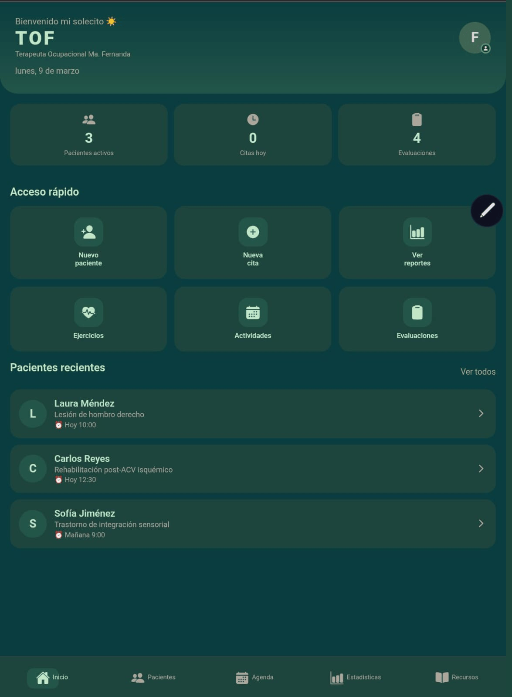

# 🌿 TOF — App para Terapia Ocupacional

<p align="center">
  
  
  
</p>

<p align="center">
  Aplicación clínica mobile-first diseñada <strong>por y para terapeutas ocupacionales</strong>. Gestiona expedientes de pacientes, agenda citas, registra sesiones y accede a una biblioteca de ejercicios de rehabilitación — todo desde un solo lugar, pensado para el flujo de trabajo real de la TO.
</p>

---

## 📱Vistas


---

## ✨ Funcionalidades

### 👩‍⚕️ Gestión de Pacientes
- Creación y administración de expedientes clínicos completos (datos personales, diagnóstico, contacto)
- Historial médico detallado: antecedentes hereditarios, patológicos, quirúrgicos, ginecológicos y más
- Indicador de estado activo / alta
- Búsqueda por nombre o diagnóstico
- Vista de pacientes recientes desde la pantalla de inicio
- Exportación de expediente en PDF

### 📅 Agenda
- Vista de calendario mensual con indicadores de citas
- Crear, visualizar y eliminar citas por día
- Tipos de cita: Evaluación inicial, Sesión de tratamiento, Seguimiento, Alta, Otro
- Tarjetas con código de color por tipo de cita
- Navegación rápida al expediente del paciente desde cualquier cita
- Agregar nuevos pacientes directamente desde el modal de citas

### 📋 Sesiones
- Registro de sesiones terapéuticas por paciente
- Campos: actividades realizadas, objetivos, respuesta del paciente, duración y plan de seguimiento
- 15 actividades sugeridas + entrada personalizada
- Todas las sesiones se guardan en el expediente del paciente

### 🏋️ Ejercicios de Rehabilitación
- Biblioteca de 14 ejercicios clínicamente curados en 5 categorías:
  - Miembro superior, Miembro inferior, Cognitivo, Sensorial, Respiratorio
- Ilustraciones SVG de figura humana completa por ejercicio
- Instrucciones clínicas paso a paso + precauciones
- **Registrar en sesión** — vincula ejercicios directamente a la última sesión de un paciente
- Filtro por categoría

### 📊 Estadísticas
- Resumen de pacientes activos, sesiones y evaluaciones
- Diagnósticos más frecuentes
- Sesiones por paciente con detalle expandible
- Actividades más utilizadas

### 🗂️ Actividades
- Biblioteca de actividades personalizadas con categorías y niveles de dificultad
- Búsqueda y filtrado
- Crear nuevas actividades con modal de hoja inferior

### 📝 Evaluaciones
- Seguimiento de evaluaciones clínicas estandarizadas (COPM, FIM, Barthel, MMSE, Sensory Profile)
- Marcado como completada o pendiente

### 👤 Perfil del Terapeuta
- Nombre, especialidad y cédula profesional
- Teléfono, correo e institución
- Foto de perfil desde la galería
- Todos los datos se guardan localmente en el dispositivo (AsyncStorage)
- Layout responsivo: dos columnas en web, una columna en móvil

---

## 🛠️ Tech Stack

| Tecnología | Propósito |
|---|---|
| [Expo](https://expo.dev) | Framework y tooling de build |
| [React Native](https://reactnative.dev) | UI multiplataforma |
| [React Navigation](https://reactnavigation.org) | Navegación Stack + Bottom Tab |
| [react-native-safe-area-context](https://github.com/th3rdwave/react-native-safe-area-context) | Manejo de áreas seguras (SafeAreaProvider) |
| [expo-linear-gradient](https://docs.expo.dev/versions/latest/sdk/linear-gradient/) | Gradientes en encabezados |
| [@expo/vector-icons](https://icons.expo.fyi) | Set de iconos Ionicons |
| [react-native-svg](https://github.com/software-mansion/react-native-svg) | Ilustraciones SVG de ejercicios |
| [@react-native-async-storage/async-storage](https://react-native-async-storage.github.io/async-storage/) | Persistencia local de datos |
| [expo-image-picker](https://docs.expo.dev/versions/latest/sdk/imagepicker/) | Foto de perfil desde galería |
| [expo-print](https://docs.expo.dev/versions/latest/sdk/print/) + [expo-sharing](https://docs.expo.dev/versions/latest/sdk/sharing/) | Exportación de PDF |
| [expo-notifications](https://docs.expo.dev/versions/latest/sdk/notifications/) | Recordatorios de citas _(en desarrollo)_ |

---

## 🚀 Cómo empezar

### Requisitos previos

- [Node.js](https://nodejs.org) 18+
- [Expo CLI](https://docs.expo.dev/get-started/installation/)
- App Expo Go en tu dispositivo ([iOS](https://apps.apple.com/app/expo-go/id982107779) / [Android](https://play.google.com/store/apps/details?id=host.exp.exponent))

### Instalación

```bash
# 1. Clonar el repositorio
git clone https://github.com/Joana2406/TOF.git
cd TOF

# 2. Instalar dependencias
npm install

# 3. Instalar dependencias nativas administradas por Expo
npx expo install react-native-screens react-native-safe-area-context
npx expo install react-native-gesture-handler
npx expo install react-native-svg
npx expo install @react-native-async-storage/async-storage
npx expo install expo-linear-gradient
npx expo install expo-image-picker
npx expo install expo-print expo-sharing expo-file-system
npx expo install expo-notifications expo-device

# 4. Iniciar el servidor de desarrollo
npx expo start
```

Escanea el código QR con Expo Go, o presiona `w` para abrir en el navegador.

---

## 📁 Estructura del proyecto

```
TOF/
├── app/
│   └── index.jsx               # Punto de entrada
├── src/
│   ├── navigation/
│   │   └── AppNavigator.jsx    # Navegación Stack + Tab (incluye SafeAreaProvider)
│   ├── context/
│   │   └── PacientesContext.jsx # Estado global (pacientes, citas)
│   ├── screens/
│   │   ├── HomeScreen.jsx
│   │   ├── PacientesScreen.jsx
│   │   ├── DetallePacienteScreen.jsx
│   │   ├── NuevoPacienteScreen.jsx
│   │   ├── NuevaSesionScreen.jsx
│   │   ├── AntecedentesScreen.jsx
│   │   ├── AgendaScreen.jsx
│   │   ├── EstadisticasScreen.jsx
│   │   ├── ActividadesScreen.jsx
│   │   ├── EjerciciosScreen.jsx
│   │   ├── EvaluacionScreen.jsx
│   │   ├── RecursosScreen.jsx
│   │   └── PerfilScreen.jsx
│   ├── components/
│   │   └── LoadingScreen.jsx
│   ├── services/
│   │   └── generarPDF.js       # Lógica de exportación PDF
│   ├── utils/
│   │   └── webFix.js           # Correcciones de layout para web (scroll, altura)
│   └── theme/
│       └── colors.js           # Tokens de diseño
└── assets/
```

---

## 🎨 Sistema de diseño

La app usa una paleta personalizada de verde bosque oscuro:

| Token | Hex | Uso |
|---|---|---|
| `deepForest` | `#051F20` | Fondo principal |
| `darkGreen` | `#173831` | Tarjetas, barra de navegación |
| `midGreen` | `#235347` | Elementos interactivos |
| `sage` | `#8CB79B` | Texto secundario, iconos |
| `mint` | `#DBF0DD` | Texto principal, highlights |

---

## 🗺️ Roadmap

- [ ] **Recordatorios de citas** — notificaciones push via `expo-notifications`
- [ ] **Exportación PDF** — generar reportes completos de pacientes como PDFs descargables
- [ ] **PDF de estadísticas** — exportar resúmenes de sesiones y diagnósticos
- [ ] **Bloqueo por PIN** — proteger expedientes con PIN numérico al abrir la app
- [ ] **Vincular ejercicios a sesiones** — precargar ejercicios al crear una nueva sesión
- [ ] **Sincronización en la nube** — respaldo opcional via Supabase o Firebase
- [ ] **Modo claro / oscuro**
- [ ] **Soporte multi-terapeuta** — diferentes perfiles por usuario del dispositivo

---

## 👩‍💻 Autora

**Joana Uribe**  
Desarrolladora de software apasionada por crear herramientas útiles para profesionales de la salud.  
Construido con 🌿 y React Native

---

## © Derechos de Autor

Copyright © 2025 Joana Uribe. Todos los derechos reservados.

Este código es propiedad exclusiva de su autora. No está permitido copiar, modificar, distribuir, sublicenciar ni usar este software, total o parcialmente, sin autorización escrita previa de Joana Uribe.
